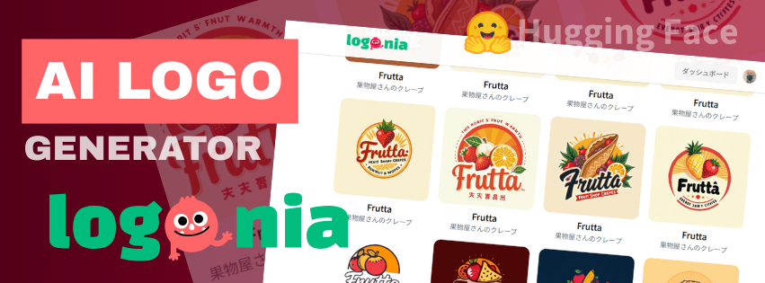
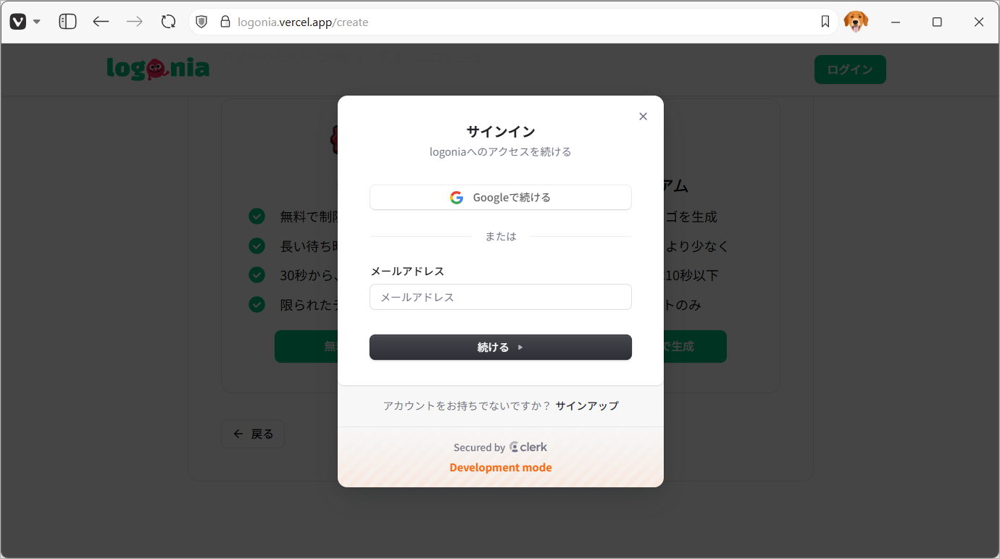

  

    
    
    
    
    
    
    
    
    
    
    
    
    
  

  <h3 align="center">AI LOGO GENERATOR APP</h3>

  

    ロゴ生成 AI アプリ
  

## 📋 <a name="table">もくじ</a>

1. 🤖 [はじめに](#intro)
2. 🔗 [URL](#url)
3. 🔋 [ロゴ生成 AI アプリの機能](#feature)
4. 🚀 [アプリの利用サンプル](#example)
5. 💻 [画面サンプル](#screen_sample)
6. 🤸 [終わりに](#outro)

## <a name="intro">🤖 はじめに</a>

数ステップの入力、選択だけでロゴが生成できる AI アプリ、**logonia** を紹介します。

## <a name="url">🔗 URL</a>

logonia | AI LOGO GENERATOR APP  
https://logonia.vercel.app

## <a name="feature">🔋 ロゴ生成 AI アプリの機能</a>

### 生成ロゴ指定への入口

- ランディングページ

### ユーザ認証機能

- ログイン
- ログアウト

### 生成ロゴ入力選択

- ✏️ 設定ステップ表示
- ✏️ 入力チェック
- 🫦 1. ロゴタイトル入力
- 🪶 2. ロゴイメージの説明入力
- 🌄 3. カラーパレット選択
- 👩‍🦯 4. ロゴデザイン選択
- 🤏 5. ロゴアイディア選択
- 🧱 6. AI モデルプラン選択

### ロゴ生成ページ

- 📥 ロゴのダウンロード
- 🧮 ダッシュボードへのリンク

### ダッシュボードページ

- 📥 生成済みロゴ一覧表示
- 📥 クレジット残高表示
- 🧮 各ロゴの個別表示

## <a name="example">🚀 アプリの利用サンプル</a>

##### ロゴ生成デモ
<!-- ./images/logonia_demo.mp4 -->
<video src="https://github.com/user-attachments/assets/1c7a47c6-e563-4b5e-966f-fb3bfa2757ac" controls="true"></video>

## <a name="screen_sample">💻 画面サンプル</a>

### 生成ロゴ指定への入口

#### ランディングページ 

### ユーザ認証機能

#### ログイン

#### ログアウト

### 生成ロゴ入力選択

#### ✏️ 設定ステップ表示

#### ✏️ 入力チェック

##### 未入力エラー

##### 未選択エラー

#### 🫦 1. ロゴタイトル入力

#### 🪶 2. ロゴイメージの説明入力

#### 🌄 3. カラーパレット選択

#### 👩‍🦯 4. ロゴデザイン選択

#### 🤏 5. ロゴアイディア選択

#### 🧱 6. AI モデルプラン選択

### ロゴ生成ページ

### ダッシュボードページ

## <a name="outro">🤸 おわりに</a>

今回は一般的に公開された AI モデルを使って、「ロゴのアイディアの選択肢を生成」と「画像の生成」を行なっています。

このアプリでは AI モデルとして、以下の３つのモデルを利用しています。

- Google Gemini
- AI モデルの公開プラットフォーム Hugging Face で公開されている「strangerzonehf/Flux-Midjourney-Mix2-LoRA」
- AI モデルプロバイダ Together AI で公開されている「FLUX.1 [schnell]」 

RAG（検索拡張生成）といわれる方法を使って、そうした AI モデルに指示するプロンプトを工夫することで、AI から必要な回答を得て、画面に結果を表示しています。

RAG をカスタマイズしたり、利用する AI モデルを変えることで、アプリに様々な AI 機能を取り入れることが可能です。
